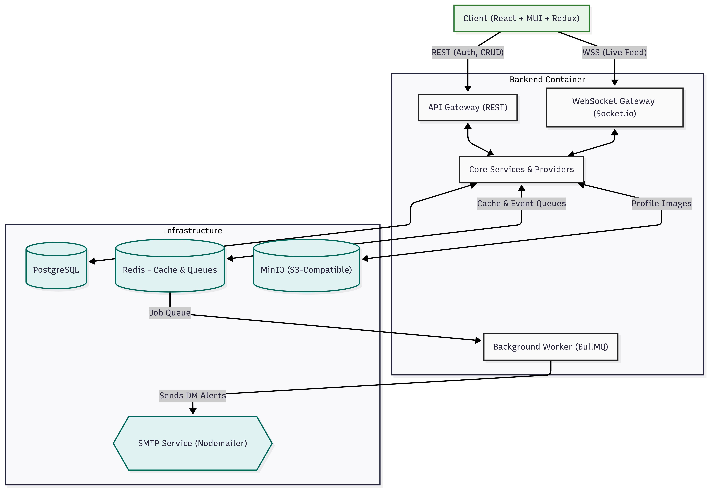
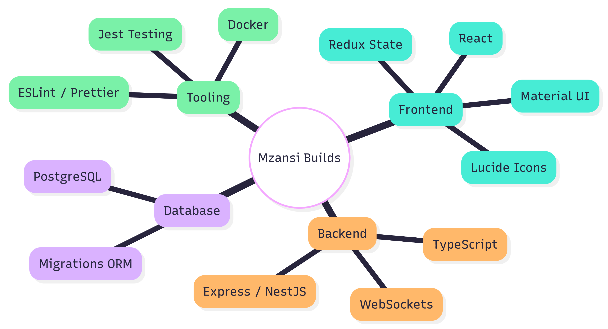
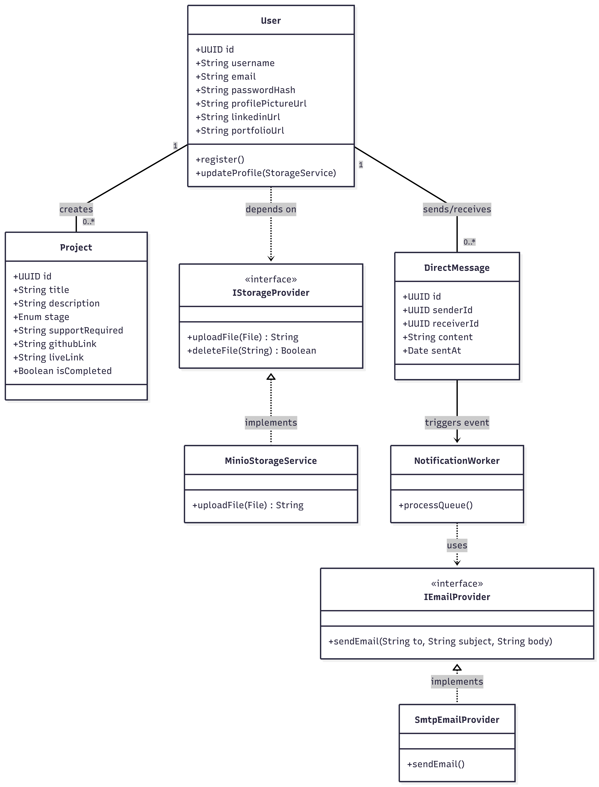

# Mzansi Builds

## Overview

Mzansi Builds is a dedicated platform designed for developers to build in public, collaborate, and showcase their technical projects. Developers can create accounts, log project milestones, and share their progress on a live community feed. Upon completion, projects are featured on a Celebration Wall. The platform supports real-time updates, direct messaging with background email notifications, and file storage for user profiles.


_Figure 1: High-Level System Architecture_

## Tech Stack


_Figure 2: Tech Stack Diagram_

**Frontend**

- React
- Redux (State Management)
- Material UI (Component Library & Theming)
- Lucide React (Iconography)

**Backend**

- TypeScript
- NestJS (Underlying Express engine)
- WebSockets (Socket.io for Live Feed)

**Data & Infrastructure**

- PostgreSQL (Primary Relational Database)
- Redis (Caching & Message Queuing)
- MinIO (S3-Compatible Object Storage)
- Nodemailer (SMTP/Email Service)
- Docker Compose (Container Orchestration)


_Figure 2: Core Class Design and Interfaces_

## Implementation Details

The application is built using a modular, scalable architecture with a strong emphasis on Object-Oriented Programming (OOP) and established design patterns:

- **Separation of Concerns:** RESTful APIs handle standard CRUD operations (users, projects), while a WebSocket gateway exclusively manages the real-time live feed.
- **Adapter Pattern:** File storage is decoupled through an `IStorageProvider` interface. The implementation currently utilizes a `MinioStorageService`, which can be swapped for cloud providers (like Azure or AWS S3) without altering business logic.
- **Observer Pattern:** System events, such as completing a project or sending a direct message, trigger event emitters.
- **Background Processing:** To prevent blocking the main thread, the application delegates email notifications to a Redis-backed message queue (BullMQ), processed asynchronously by a background worker.
- **Dependency Injection:** Handled natively via NestJS to manage class dependencies, ensuring high testability and clean structural design.

## Directory Structure

The project is divided into distinct environments to separate the client, server, and containerized services.

```text
mzansi-builds/
├── frontend/                  # React Application
│   ├── src/
│   │   ├── components/        # Reusable UI components
│   │   ├── pages/             # Route-level components (Home, Profile, Project)
│   │   ├── store/             # Redux slices and store configuration
│   │   └── theme/             # MUI theme overrides (Green, White, Black)
│   ├── package.json
│   └── vite.config.ts
│
├── backend/                   # NestJS Application
│   ├── src/
│   │   ├── core/              # Interfaces, Interceptors, and Filters
│   │   ├── modules/           # Feature modules (Auth, Projects, Feed)
│   │   └── services/          # Business logic and external providers
│   │       ├── storage/       # MinIO adapter implementation
│   │       ├── mail/          # SMTP configuration and queues
│   │       └── database/      # TypeORM/Prisma configurations and entities
│   ├── package.json
│   └── tsconfig.json
│
└── infrastructure/            # Docker Services & Configs
    ├── docker-compose.yml     # Orchestration for DB, Redis, and MinIO
    ├── minio/                 # MinIO setup scripts and volume mounts
    ├── postgres/              # Database initialization scripts
    └── redis/                 # Redis configuration and volume mounts
```

## Running the Container

Follow these instructions to start the local infrastructure and application servers. Ensure you have Docker Desktop installed and running on your machine.

### 1. Start the Infrastructure Services

Navigate to the infrastructure directory and start the background services (PostgreSQL, Redis, MinIO).
Bash

    cd infrastructure
    docker-compose up -d

Note: The -d flag runs the containers in detached mode.

### 2. Initialise the Backend

Open a new terminal window, navigate to the backend directory, install dependencies, run database migrations, and start the development server.
Bash

    cd backend
    npm install
    npm run migration:run
    npm run start:dev

The backend API will run on http://localhost:3000.

### 3. Initialize the Frontend

Open a third terminal window, navigate to the frontend directory, install dependencies, and start the React client.
Bash

    cd frontend
    npm install
    npm run dev

The frontend will run on http://localhost:5173.

To shut down the infrastructure services when you are finished, navigate back to the infrastructure directory and run:
Bash

    docker-compose down

## Getting Started (Docker Installation)

The entire application stack (Frontend, Backend, Database, Cache, and Storage) is containerized. Ensure you have Docker and Docker Desktop/Compose installed and running on your machine.

### 1. Configure Environment Variables

Before starting the containers, you need to configure your environment variables (specifically for authentication and email notifications).

Create a .env file in the backend/ directory (or update the environment section directly in your root docker-compose.yml) with the following required keys:
Code snippet

```
 --- Database ---

    DB_HOST=postgres
    DB_PORT=5432
    DB_USER=postgres
    DB_PASSWORD=postgres_password
    DB_NAME=mzansi_builds

 --- Redis ---

    REDIS_HOST=redis
    REDIS_PORT=6379

 --- MinIO Storage ---

    MINIO_ENDPOINT=minio
    MINIO_PORT=9000
    MINIO_PUBLIC_ENDPOINT=localhost
    MINIO_ACCESS_KEY=minioadmin
    MINIO_SECRET_KEY=minioadmin
    MINIO_BUCKET_NAME=mzansi-profiles

 --- Authentication ---

    JWT_SECRET=your_super_secret_development_key
    JWT_EXPIRATION=7d

 --- Email (Brevo SMTP) ---

    SMTP_HOST=smtp-relay.brevo.com
    SMTP_PORT=587
    SMTP_USER=your_brevo_email@example.com
    SMTP_PASSWORD=your_brevo_smtp_master_password
    SMTP_FROM=your_verified_sender_email@example.com

    OTEL_EXPORTER_OTLP_ENDPOINT=http://jaeger:4318/v1/traces
    OTEL_SERVICE_NAME=mzansi-builds-backend
```

## 2. Start the Application

Open a terminal in the root directory of the project (where the docker-compose.yml file is located) and run:
Bash

    docker-compose up --build -d

Note: The --build flag ensures your React and NestJS images are freshly built, and the -d flag runs the containers in the background. 3. Access the Services

Once the containers are successfully spun up and healthy, you can access the platform:

    Frontend (React App): http://localhost:5173

    Backend (API Base URL): http://localhost:3000

    MinIO Console (Storage UI): http://localhost:9001 (Login: minioadmin / minioadmin)

## Stopping the Application

To shut down the infrastructure services and application containers when you are finished, run:
Bash

    docker-compose down

(To completely wipe the database and storage volumes as well, append the -v flag: docker-compose down -v)
